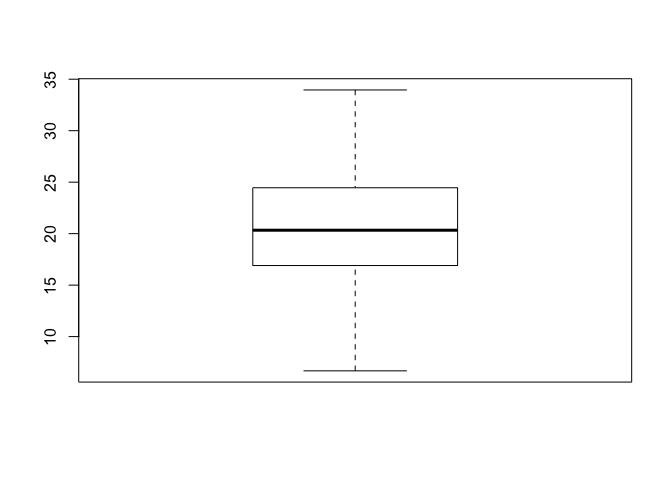
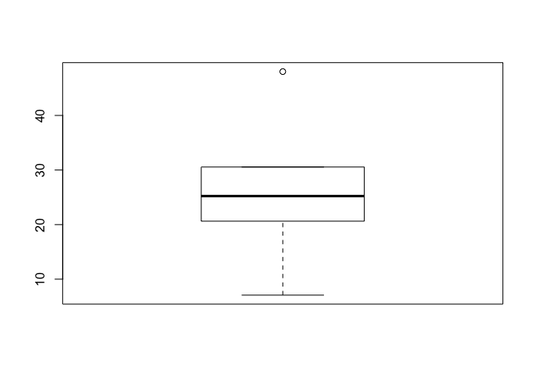
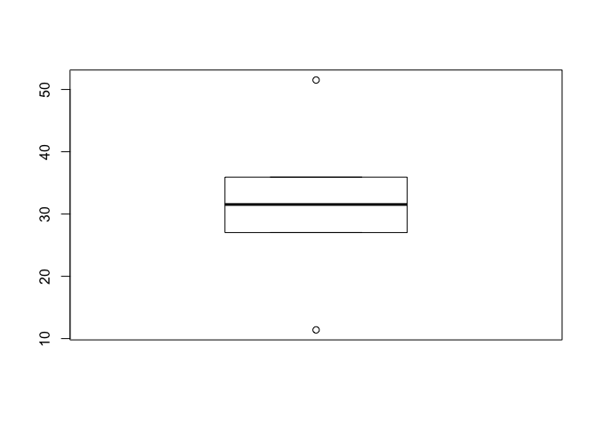
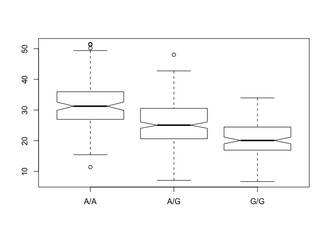
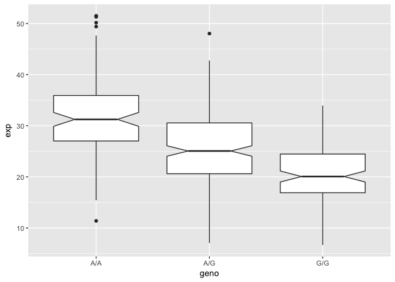

## 1000 Genome project data
Read 1000 genome data for MXL dataset

```r
genotype<-read.csv("373531-SampleGenotypes-Homo_sapiens_Variation_Sample_rs12936231.csv")
```

```r
table(genotype[,2]) / nrow(genotype)*100
```

```
## 
##     C|C     C|G     G|C     G|G 
## 34.3750 32.8125 18.7500 14.0625
```

```r
library(seqinr)
library(gtools)
```
### Base quality scores from fastqsanger

```r
library(seqinr)
library(gtools)
phred <- asc( s2c("DDDDCDEDCDDDDBBDDDCC@") ) - 33
phred 
```

```
##  D  D  D  D  C  D  E  D  C  D  D  D  D  B  B  D  D  D  C  C  @ 
## 35 35 35 35 34 35 36 35 34 35 35 35 35 33 33 35 35 35 34 34 31
```


```r
# install.packages("seqinr")
```


```r
# install.packages("gtools")
```
## RNA-seq results analysis (interested in assessing genetic differences on a population scale. processed
about ~230 samples and did the normalization on a genome level.  want to find
whether there is any association of the 4 asthma-associated SNPs (rs8067378…) on
ORMDL3 expression. )

```r
geno <- read.table("rs8067378_ENSG00000172057.6.txt")
```


```r
summary(geno)
```

```
##      sample     geno          exp        
##  HG00096:  1   A/A:108   Min.   : 6.675  
##  HG00097:  1   A/G:233   1st Qu.:20.004  
##  HG00099:  1   G/G:121   Median :25.116  
##  HG00100:  1             Mean   :25.640  
##  HG00101:  1             3rd Qu.:30.779  
##  HG00102:  1             Max.   :51.518  
##  (Other):456
```
## we want to know if genotype g/g is different expression than a/a

```r
gg <- summary(geno$exp[geno$geno == "G/G"])
ag <- summary(geno$exp[geno$geno == "A/G"])
aa <- summary(geno$exp[geno$geno == "A/A"])
```
## want to make a nice boxplot, my attempt...


```r
boxplot(gg)
```

<!-- -->

```r
boxplot(ag)
```

<!-- -->

```r
boxplot(aa)
```

<!-- -->

```r
boxplot(exp ~ geno, data=geno, notch = TRUE)
```

<!-- -->

# how about a nice result? ggplot

```r
library(ggplot2)

p <- ggplot(geno, aes(geno,exp)) + geom_boxplot(notch = TRUE)
p
```

<!-- -->

