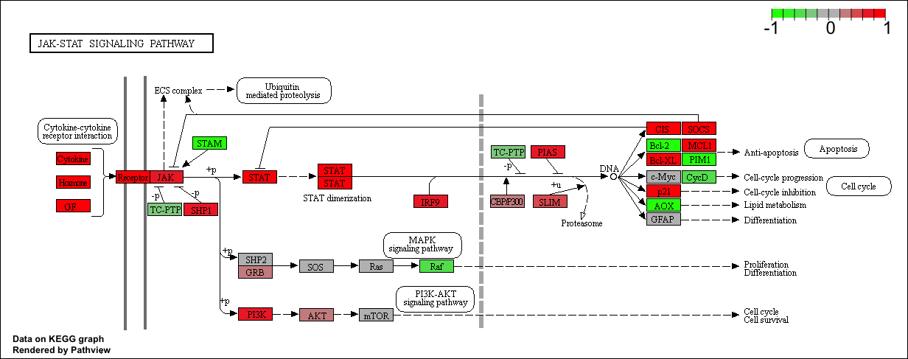

```{r setup, include=FALSE}
knitr::opts_chunk$set(echo = TRUE)
```

# source("http://bioconductor.org/biocLite.R")
# biocLite()

# For this class, you'll also need DESeq2:
biocLite("DESeq2")
```{r}
# source("http://bioconductor.org/biocLite.R")
# biocLite()

# For this class, you'll also need DESeq2:
# biocLite("DESeq2")
```
```{r, echo=FALSE}
library(DESeq2)
```
Load data files
```{r}
metaFile <- "GSE37704_metadata.csv"
countFile <- "GSE37704_featurecounts.csv"

# Import metadata and take a peak
colData = read.csv(metaFile, row.names=1)
head(colData)
```
```{r}
# Import countdata
countData = read.csv(countFile, row.names=1)
head(countData)
```
#need to remove column "length" becauses need countDAta and colData files to match
```{r}
countData <- as.matrix(countData[,-1])
head(countData)
```

# now want to get rid of all zero entries
```{r}
# Filter count data where you have 0 read count across all samples.
countData = countData[rowSums(countData)>1, ]
head(countData)
```

# setup DESeqDataSet required for DESeq()
```{r}
dds = DESeqDataSetFromMatrix(countData=countData,
                             colData=colData,
                             design=~condition)
# condition is what comparing across
# run DE analysis
dds = DESeq(dds)
```
# next extract results table
```{r}
res <- results(dds, alpha = 0.05, lfcThreshold = 2)
res

```
```{r}
mcols(res, use.names = TRUE)
```
### Summarize results
```{r}
summary(res)
```

# change logfold change and p-value to get more manageable set-went up and edited results() to results(dds, alpha = 0.05, lfcThreshold = 2)

#use table function
```{r}
table(res$padj < 0.05)
```

```{r}
table(res$log2FoldChange > 2)
```

#combine the two to see how many genes meet both the 2logfold change and 0.05 pvalue
```{r}
table( res$padj < 0.05, res$log2FoldChange > 2)
```
#p values below 0.05 
```{r}
table(res$pvalue < 0.05)
```

# BH adjusted p-values, (in brief, this method calculates for each gene an adjusted p value that answers the following question: if one called significant all genes with an adjusted p value less than or equal to this gene’s adjusted p value threshold, what would be the fraction of false positives (the false discovery rate, FDR) among them, in the sense of the calculation outlined above? )
```{r}
table(res$padj < 0.05)
```
# subset genes with adjusted p values, sort by log2fold change, trying to get genes with strongest down regulation

```{r}
# Make a new results object 'resSig' with only significant genes
resSig <- subset(res, padj < 0.05)
```


```{r}
# Print the first 10 strongest DOWN genes
ord.down <- order(resSig$log2FoldChange)
head(resSig[ ord.down, ], 10)
```


```{r}
# Print the first 10 strongest UP genes
ord.up <- order(resSig$log2FoldChange, decreasing = TRUE)
head(resSig[ ord.up, ], 10)
```

### Annotating genes and mapping to Entrez IDs 

```{r}
#biocLite("org.Hs.eg.db")
library("AnnotationDbi")
library("org.Hs.eg.db")

columns(org.Hs.eg.db)
```

```{r}
#source("http://bioconductor.org/biocLite.R")
#biocLite(c("pathview", "gage", "gageData"))
```
```{r}
res$symbol = mapIds(org.Hs.eg.db,
                    keys=row.names(res), 
                    column="SYMBOL",
                    keytype="ENSEMBL",
                    multiVals="first")

res$entrez = mapIds(org.Hs.eg.db,
                    keys=row.names(res), 
                    column="ENTREZID",
                    keytype="ENSEMBL",
                    multiVals="first")

res$name =   mapIds(org.Hs.eg.db,
                    keys=row.names(res), 
                    column="GENENAME",
                    keytype="ENSEMBL",
                    multiVals="first")

head(res, 10)
```
```{r}
library(pathview)

```
```{r}
library(gage)
library(gageData)
data(kegg.sets.hs)
data(sigmet.idx.hs)

kegg.sets.hs = kegg.sets.hs[sigmet.idx.hs]
head(kegg.sets.hs, 3)
```

```{r}
foldchanges = res$log2FoldChange
names(foldchanges) = res$entrez
head(foldchanges)
```
```{r}
# Get the results
keggres = gage(foldchanges, gsets=kegg.sets.hs, same.dir=TRUE)
```

# Look at results
```{r}
attributes(keggres)
```
# a list object
```{r}
head(keggres$greater)
```
```{r}
head(keggres$less)
```
```{r}
lapply(keggres, head)
```
```{r}
## Sanity check displaying all pathways data
pathways = data.frame(id=rownames(keggres$greater), keggres$greater)
head(pathways)
```

```{r}
pathview(gene.data=foldchanges, pathway.id="hsa04110")
# to have preview of picture to appear
```
# To generate PDF graph
```{r}
# A different PDF based output of the same data
pathview(gene.data=foldchanges, pathway.id="hsa04110", kegg.native=FALSE)
```


```{r}
## Focus on top 5 upregulated pathways here for demo purposes only
keggrespathways <- rownames(keggres$greater)[1:5]

# Extract the IDs part of each string
keggresids = substr(keggrespathways, start=1, stop=8)
keggresids
```
```{r}
# Finally, lets pass these IDs in keggresids to the pathview() function to draw plots for all the top 5 pathways.

pathview(gene.data=foldchanges, pathway.id=keggresids, species="hsa")
```
Finally, lets pass these IDs in keggresids to the pathview() function to draw plots for all the top 5 pathways.





### Section 3, Gene ontology (GO)

```{r}
data(go.sets.hs)
data(go.subs.hs)
gobpsets = go.sets.hs[go.subs.hs$BP]

gobpres = gage(foldchanges, gsets=gobpsets, same.dir=TRUE)

lapply(gobpres, head)
```
## Reactome pathway analysis
```{r}
sig_genes <- res[res$padj <= 0.05 & !is.na(res$padj), "symbol"]
print(paste("Total number of significant genes:", length(sig_genes)))
```
```{r}
write.table(sig_genes, file="significant_genes.txt", row.names=FALSE, col.names=FALSE, quote=FALSE)
```

### Section 5, GO analysis
